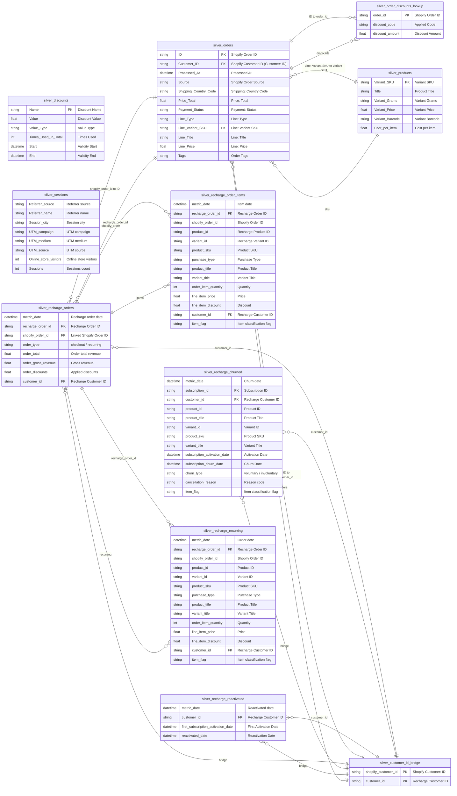
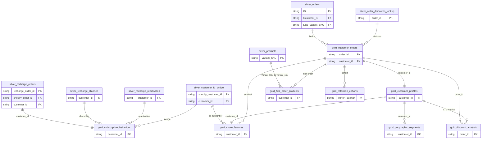

# LushProtein Database Schema (ERD)

This document contains the Entity-Relationship Diagrams (ERDs) for the LushProtein customer database, split into logical layers (Silver and Gold) for readability, followed by a unified diagram. 

---

## 1. Silver Layer (Cleaned Source Data)
The Silver layer contains cleaned and structured data directly ingested from source tables, including Shopify orders, product catalogs, discount codes, website sessions, and Recharge subscription events.



---

## 2. Gold Layer (Dimensional & Analytical Features)
The Gold layer contains consolidated, high-value tables optimized for business intelligence, RFM segmentation, customer lifetime value (LTV) calculation, churn prediction modeling, and cohort analysis.

```mermaid
erDiagram
  direction LR

  gold_customer_orders {
    string order_id PK "Shopify Order ID"
    string order_name "Order Name (LPSG-XXXX)"
    string customer_id FK "Shopify Customer ID"
    datetime processed_at "Order Date"
    string channel "Standardised Channel"
    string Source "Shopify Order Source"
    string country_code "Shipping Country"
    string city "Shipping City"
    float price_total "Total Paid"
    float price_subtotal "Subtotal"
    float price_total_discount "Total Discount"
    float price_total_shipping "Shipping Cost"
    float price_total_refund "Refund Amount"
    string payment_status "Payment Status"
    string fulfillment_status "Fulfillment Status"
    datetime cancelled_at "Cancellation Date"
    string cancel_reason "Cancellation Reason"
    string utm_source "UTM Source"
    string utm_medium "UTM Medium"
    string utm_campaign "UTM Campaign"
    string discount_code "Applied Discount Code"
    float discount_amount "Applied Discount Amt"
    float order_sequence "Order Number for Customer"
    bool is_first_order "First Order Flag"
    float days_since_last_order "Interpurchase Time"
    bool is_subscription_order "Is Subscription Flag"
    bool is_recurring_order "Is Recurring Flag"
    float recurring_order_num "Recurring Cycle Number"
    string customer_tags "Customer Tags"
    string order_tags "Order Tags"
  }
  gold_customer_profiles {
    string customer_id PK "Shopify Customer ID"
    datetime first_order_date "First Purchase Date"
    datetime last_order_date "Last Purchase Date"
    int total_orders "Total Lifetime Orders"
    float total_revenue "Total Lifetime Spend"
    float avg_order_value "Average Order Value (AOV)"
    float total_discount_amt "Total Discounts Received"
    string country_code "Acquisition Country"
    string city "Acquisition City"
    int recency_days "Days since last purchase"
    string acquisition_channel "First Order Channel"
    string acquisition_country "First Order Country"
    string acquisition_discount_code "First Order Discount Code"
    float acquisition_discount_amt "First Order Discount Amt"
    string acquisition_utm_source "First Order UTM Source"
    string acquisition_utm_medium "First Order UTM Medium"
    string acquisition_utm_campaign "First Order UTM Campaign"
    string rfm_group "RFM Customer Segment"
    string rfm_score "RFM Score String"
    string gender "Inferred Gender"
    bool is_repeat_customer "Has Repeat Purchases"
    bool is_discount_acquired "Used Discount on Order 1"
    float days_to_second_order "Days to 2nd Order"
    bool repeat_purchase_90d "Repeat inside 90 days"
  }
  gold_first_order_products {
    string customer_id FK "Shopify Customer ID"
    string order_id FK "Shopify Order ID"
    datetime processed_at "First Order Date"
    string country_code "Shipping Country"
    string channel "Acquisition Channel"
    string variant_sku FK "Product SKU"
    string product_category "Category Class"
    string line_title "Product Line Title"
    string variant_title "Flavour/Size details"
    string product_title "Parent Product Title"
    string variant_grams "Variant Weight"
    float quantity "Quantity Ordered"
    float unit_price "Unit Price"
    float line_discount "Line Discount Amt"
    float line_total "Line Net Revenue"
    bool has_sku "Has Valid SKU"
    bool repeat_purchase_90d "Repeat inside 90d"
    float days_to_second_order "Days to 2nd Order"
    string category_source "Source category flag"
    bool is_free_gift "Free Gift Flag"
  }
  gold_discount_analysis {
    string customer_id FK "Shopify Customer ID"
    string order_id PK "Shopify Order ID"
    string order_name "Order Name"
    datetime processed_at "Order Date"
    string channel "Channel"
    string country_code "Country"
    float price_total "Total Revenue"
    float price_total_discount "Total Discount Amt"
    string discount_code "Discount Code"
    float discount_amount "Discount Amt"
    string discount_type "B2B / Affiliate / Standard"
    bool is_high_magnitude "Discount >= 20% or $30"
    bool is_b2b_or_affiliate "B2B/Affiliate flag"
    bool is_stacked_discount "Multiple codes used"
    float order_sequence "Order Sequence"
    bool is_first_order "First Order Flag"
    float total_orders "Customer Total Orders"
    float total_revenue "Customer Total LTV"
    float avg_order_value "Customer AOV"
    bool repeat_purchase_90d "Customer 90d Repeat Flag"
    string rfm_group "Customer RFM Group"
    bool is_repeat_customer "Customer Repeat Flag"
  }
  gold_churn_features {
    string customer_id PK "Shopify Customer ID"
    datetime first_order_date "First Order Date"
    int total_orders "Total Orders"
    float days_to_second_order "Days to 2nd Order"
    bool repeat_purchase_90d "Repeat in 90d"
    string acquisition_channel "First Order Channel"
    string acquisition_country "First Order Country"
    string acquisition_discount_code "First Order Discount Code"
    float acquisition_discount_amt "First Order Discount Amt"
    bool is_discount_acquired "Discount acquired flag"
    string rfm_group "RFM Group"
    string rfm_score "RFM Score"
    string gender "Gender"
    bool event_occurred "Churn Event Occurred (No order in 90d)"
    float survival_duration "Days to Churn or Last Order"
    bool churned_before_90d "Churned before 90d flag"
    float first_order_aov "First Order AOV"
    float first_order_total_discount "First Order Discount Total"
    float first_order_shipping "First Order Shipping Cost"
    string first_order_discount_code "First Order Discount Code"
    float first_order_discount_amt "First Order Discount Amt"
    float first_order_discount_pct "First Order Discount %"
    bool first_order_discount_flag "First Order Discount Flag"
    string discount_type "First Order Discount Type"
    bool is_high_magnitude "First Order Discount High Magnitude"
    bool is_b2b_or_affiliate "First Order B2B/Affiliate Flag"
    float first_order_num_items "First Order Distinct SKUs"
    float first_order_num_categories "First Order Unique Categories"
    string first_order_top_category "First Order Top Category"
    float first_order_total_qty "First Order Total Quantity"
    bool first_order_has_acc "First Order contains Accessories"
    bool first_order_has_bnd "First Order contains Bundle"
    bool first_order_has_col "First Order contains Collagen"
    bool first_order_has_cre "First Order contains Creatine"
    bool first_order_has_cap "First Order contains Caps/Pills"
    bool first_order_has_protein "First Order contains Protein"
    bool first_order_is_multi_category "First Order Multi-Category"
    int first_order_month "First Order Month"
    int first_order_quarter "First Order Quarter"
    int first_order_year "First Order Year"
    int first_order_dow "First Order Day of Week"
    bool first_order_is_weekend "First Order Weekend flag"
    bool first_order_is_zero_price "First Order Net-Free flag"
    bool is_subscriber "Is Subscription Customer"
  }
  gold_subscription_behaviour {
    string customer_id PK "Recharge Customer ID"
    int total_rc_orders "Total Recharge Orders"
    int total_checkout_orders "Total Subscription Checkout Orders"
    int total_recurring_orders "Total Recurring Cycles"
    datetime first_order_date "First Recharge Order Date"
    datetime last_order_date "Last Recharge Order Date"
    float total_spend "Total Subscription Spend"
    float avg_order_value "Subscription AOV"
    float total_discounts "Total Subscription Discounts"
    float avg_order_interval "Average Recurring Interval (days)"
    float max_order_interval "Max Recurring Interval"
    float std_order_interval "Standard Dev Recurring Interval"
    float last_interval "Last Recurring Cycle Interval"
    bool is_interval_stretching "Last cycle > 1.5x average"
    int unique_skus "Unique SKUs Ordered"
    int unique_flavours "Unique Flavours Ordered"
    int total_items_ordered "Total Items Ordered"
    string most_ordered_sku "Most Ordered SKU"
    string most_ordered_flavour "Most Ordered Flavour"
    bool is_flavour_rotator "Ordered >1 unique flavour"
    string churn_type "Recharge Churn Type"
    string cancellation_reason "Recharge Cancellation Reason"
    datetime subscription_activation_date "Activation Date"
    datetime subscription_churn_date "Churn Date"
    float subscription_lifetime_days "Active Subscription Duration"
    string churned_skus "SKUs active at Churn"
    bool is_churned "Subscription Churn Flag"
    bool is_reactivated "Reactivation Event Flag"
    bool is_converted "Shopify to Recharge Link Flag"
    bool converted_to_subscription "One-time Buyer became Subscriber"
  }
  gold_geographic_segments {
    string customer_id PK "Shopify Customer ID"
    string acquisition_country "Country segment"
    string acquisition_channel "Acquisition channel"
    datetime first_order_date "First Order Date"
    datetime last_order_date "Last Order Date"
    int total_orders "Total Orders"
    float total_revenue "Total Revenue"
    float avg_order_value "AOV"
    float total_discount_amt "Total Discount"
    bool is_discount_acquired "Used Discount 1st Order"
    string acquisition_discount_code "1st Discount Code"
    bool repeat_purchase_90d "Repeat in 90d"
    bool is_repeat_customer "Is Repeat Customer"
    float days_to_second_order "Days to 2nd Order"
    string rfm_group "RFM Group"
    string rfm_score "RFM Score"
    string gender "Gender"
    int recency_days "Recency days"
    float discount_usage_rate "% orders with discounts"
    int orders_with_discount "Count orders with discount"
    string top_product_category "Most purchased category"
    bool is_subscriber "Is Subscriber"
    bool converted_to_subscription "Converted from one-time"
  }
  gold_retention_cohorts {
    period cohort_quarter PK "Quarterly Cohort Group (e.g. 2022Q1)"
    int period_number PK "Cohort cycle age index (0, 1, 2...)"
    int active_customers "Customers active in cycle"
    int cohort_size "Total starting cohort size"
    float retention_rate "% cohort active"
    float avg_revenue_per_customer "Average revenue in cycle"
  }

  %% Gold Relationships
  gold_customer_orders ||--|| gold_customer_profiles : "customer_id"
  gold_customer_orders ||--o{ gold_first_order_products : "first order"
  gold_customer_orders ||--o{ gold_discount_analysis : "order_id"
  gold_customer_profiles ||--o{ gold_discount_analysis : "LTV metrics"
  gold_customer_profiles ||--|| gold_churn_features : "customer_id"
  gold_customer_orders ||--o{ gold_churn_features : "survival"
  gold_customer_profiles ||--o{ gold_geographic_segments : "customer_id"
  gold_customer_orders ||--o{ gold_retention_cohorts : "cohort"
  gold_customer_profiles ||--o{ gold_customer_orders : customer_id
  gold_customer_orders ||--o{ gold_first_order_products : first_order
  gold_customer_orders ||--o{ gold_discount_analysis : order_id
  gold_customer_profiles ||--o{ gold_discount_analysis : ltv
  gold_customer_profiles ||--|| gold_churn_features : customer_id
  gold_customer_orders ||--o{ gold_churn_features : survival
  gold_customer_profiles ||--|| gold_geographic_segments : customer_id
  gold_customer_orders ||--o{ gold_retention_cohorts : cohort
```



---

## 3. Fully Integrated Database Schema
For reference, this diagram shows how the Silver source tables flow into and build the Gold analytical tables.


  silver_orders }o--|| gold_customer_orders : builds
  silver_order_discounts_lookup ||--o{ gold_customer_orders : enriches
  silver_products ||--o{ gold_first_order_products : sku
  silver_customer_id_bridge ||--o{ gold_churn_features : is_subscriber
  silver_recharge_orders ||--|| gold_subscription_behaviour : customer_id
  silver_recharge_churned ||--o{ gold_subscription_behaviour : churn
  silver_recharge_reactivated ||--o{ gold_subscription_behaviour : reactivated
  silver_customer_id_bridge ||--o{ gold_subscription_behaviour : bridge

  %% Gold Internal Connections
  gold_customer_orders ||--|| gold_customer_profiles : customer_id
  gold_customer_orders ||--o{ gold_first_order_products : first_order
  gold_customer_orders ||--o{ gold_discount_analysis : order_id
  gold_customer_profiles ||--o{ gold_discount_analysis : ltv
  gold_customer_profiles ||--|| gold_churn_features : customer_id
  gold_customer_orders ||--o{ gold_churn_features : survival
  gold_customer_profiles ||--o{ gold_geographic_segments : customer_id
  gold_customer_orders ||--o{ gold_retention_cohorts : cohort
```
