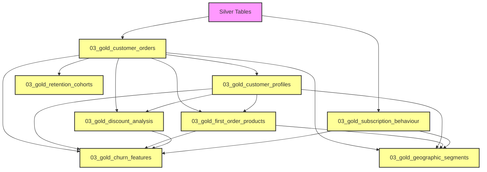

# LushProtein Customer Analytics & Insights

This repository contains the data engineering pipeline and customer analytics notebooks for **LushProtein**, built using a Medallion Architecture (Bronze ➔ Silver ➔ Gold layers) to power downstream customer cohort analysis, repeat purchase prediction, and subscriber churn forecasting.

---

## 📂 Project Directory Structure

The repository has been restructured into clean, self-contained directories:

*   **[`data/`](file:///Users/bennyteo/Desktop/Benny/MITB/Term%203/ISSS603%20Applied%20Data%20Science%20for%20Customer%20Insights/Project/LushProtein_Project_Data_20260505/data)**: Holds raw customer transaction logs, product master files, campaign reports, discount metadata, and Recharge files.
*   **[`medallion/`](file:///Users/bennyteo/Desktop/Benny/MITB/Term%203/ISSS603%20Applied%20Data%20Science%20for%20Customer%20Insights/Project/LushProtein_Project_Data_20260505/medallion)**: Medallion layer notebooks organized into subfolders:
    *   **[`bronze/`](file:///Users/bennyteo/Desktop/Benny/MITB/Term%203/ISSS603%20Applied%20Data%20Science%20for%20Customer%20Insights/Project/LushProtein_Project_Data_20260505/medallion/bronze)**: Ingests raw data files into raw bronze Parquet tables.
    *   **[`silver/`](file:///Users/bennyteo/Desktop/Benny/MITB/Term%203/ISSS603%20Applied%20Data%20Science%20for%20Customer%20Insights/Project/LushProtein_Project_Data_20260505/medallion/silver)**: Deduplicates, casts datatypes, normalizes text/currencies to SGD, and exports clean silver tables.
    *   **[`gold/`](file:///Users/bennyteo/Desktop/Benny/MITB/Term%203/ISSS603%20Applied%20Data%20Science%20for%20Customer%20Insights/Project/LushProtein_Project_Data_20260505/medallion/gold)**: Combines order details, profiles, margins, and cohort variables into feature matrices.
*   **[`analysis/`](file:///Users/bennyteo/Desktop/Benny/MITB/Term%203/ISSS603%20Applied%20Data%20Science%20for%20Customer%20Insights/Project/LushProtein_Project_Data_20260505/analysis)**: Downstream analytics notebooks, including Exploratory Data Analysis (EDA) and predictive modeling.
*   **[`scripts/`](file:///Users/bennyteo/Desktop/Benny/MITB/Term%203/ISSS603%20Applied%20Data%20Science%20for%20Customer%20Insights/Project/LushProtein_Project_Data_20260505/scripts)**: Command-line runners and verification scripts.

---

## ⚙️ Execution Pipeline Sequence

To run the pipeline or execute individual notebooks, you must follow the correct sequencing due to internal database dependencies.

### 1. Ingestion & Cleaning Layers
1.  Run **`medallion/bronze/01_bronze_ingestion.ipynb`** (generates raw bronze Parquet tables).
2.  Run **`medallion/silver/02_silver_cleaning.ipynb`** (deduplicates, casts data types, aligns currency conversion rates to SGD, and outputs clean silver tables).

### 2. Gold Layer Notebook Dependencies
The Gold layer notebooks must be executed in a specific sequence because downstream analytics notebooks load Parquet files generated by upstream gold notebooks:

*   **Step 2.1: Base Tables** (loads Silver Parquet tables only):
    *   `03_gold_customer_orders.ipynb`
    *   `03_gold_subscription_behaviour.ipynb`
*   **Step 2.2: Profiles & Cohorts** (requires `gold_customer_orders.parquet`):
    *   `03_gold_customer_profiles.ipynb`
    *   `03_gold_retention_cohorts.ipynb`
*   **Step 2.3: Analytics Layers** (requires `gold_customer_orders.parquet` & `gold_customer_profiles.parquet`):
    *   `03_gold_discount_analysis.ipynb`
    *   `03_gold_first_order_products.ipynb`
*   **Step 2.4: Consolidated Outputs** (requires Step 2.3 and Step 2.1 outputs):
    *   `03_gold_geographic_segments.ipynb`
    *   `03_gold_churn_features.ipynb`

### 3. Downstream Predictions & Strategic Analyses
Run the notebooks in the `analysis/` folder to perform strategic deep-dives:
*   **`04_acquisition_dynamics.ipynb`**: Analyzes cohort Customer Lifetime Value (LTV) and organic vs. discount-driven acquisition.
*   **`04_business_context_visuals.ipynb`**: Generates high-level business context charts, including revenue growth and channel share evolution.
*   **`04_category_vtd_brand_evolution.ipynb`**: Tracks category-level Value-to-Date (VTD) and product category preference shifts over time.
*   **`04_channel_heterogeneity.ipynb`**: Compares customer behavior, AOV, order rates, and retention across DTC, Lazada, Shopee, and Social Referral.
*   **`04_churn_analysis.ipynb`**: Evaluates customer return windows and churn factors (early conversion vs. replenishment cycles).
*   **`04_clv_decay_forecast.ipynb`**: Applies BG/NBD and Gamma-Gamma models to forecast future revenue, identify revenue-at-risk, and target lapsed VIPs.
*   **`04_decile_churn_analysis.ipynb`**: Details the concentration of revenue and retention dynamics among top-decile customer segments.
*   **`04_eda.ipynb`**: Explores baseline distributions of orders, spends, subscription signups, and customer lifespans.
*   **`04_interpurchase_timechart.ipynb`**: Maps inter-purchase times (IPT) to establish replenishment consumption windows.
*   **`04_prod_bundling.ipynb`**: Runs Association Rules Mining (Market Basket Analysis) to find co-purchased SKUs and starter kit opportunities.
*   **`04_product_sku_analysis.ipynb`**: Reviews individual product margins and country-specific flavor and size (SKU) preferences.
*   **`04_repeat_decay_analysis.ipynb`**: Evaluates historic, multi-window repeat purchase velocity by channel, category, and country.
*   **`04_repeat_purchase_prediction.ipynb`**: Trains machine learning models (Logistic Regression & Random Forest) to predict 90-day repeat purchase probabilities.
*   **`04_targeting_profile.ipynb`**: Profiles the "moveable middle" (D2-D5) customer segments and models first-order predictors of top-decile loyalty.

